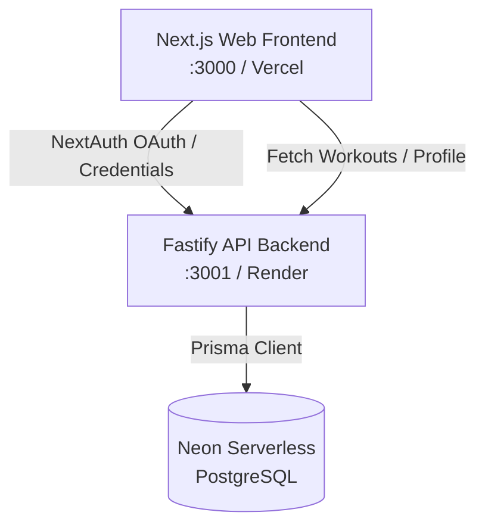

# FitSaaS V3 Architecture

Welcome to the **FitSaaS Command Center** architecture documentation.

## System Topology Overview

## Architectural Layers

### 1. Web Portal (`apps/web`)
- **Framework**: Next.js 16 (React 19, Turbopack, Tailwind CSS v4).
- **Authentication**: `next-auth` integration utilizing credentials (email/password) and Google OAuth providers.
- **Dynamic Personalization**: Calculates and renders specialized hormonal cycle phases (Follicular, Ovulatory, Luteal, Menstrual) and feeds recommendations.
- **3D Card Systems**: Smooth, hardware-accelerated, dynamic-height Y-axis 3D flip card system for logging workouts.

### 2. Service Backend (`apps/api`)
- **Runtime**: Fastify 4.x.
- **Security**: JWT token checking (`@fastify/jwt`) with automated request decoration (`server.authenticate`).
- **Endpoints**:
  - `/auth/register` (New email/password profiles)
  - `/auth/login` (Standard credential validation)
  - `/auth/google` (Symmetric OAuth registration and token issuing)
  - `/auth/me` (Profile retrieval)
  - `/auth/profile` (Gender and cycle parameters logging)
  - `/workouts` (CRUD logged routines)

### 3. Database Layer (`packages/database`)
- **OR/M**: Prisma Client.
- **Provider**: PostgreSQL via Neon Serverless.
- **Entity Models**:
  - `User`: Handles credentials, names, dates, and personalized parameters (`gender`, `cycleLength`, `lastPeriodStart`).
  - `Workout`: Routine sessions linked to `User`.
  - `Exercise` / `Set`: Specific movements and reps.
