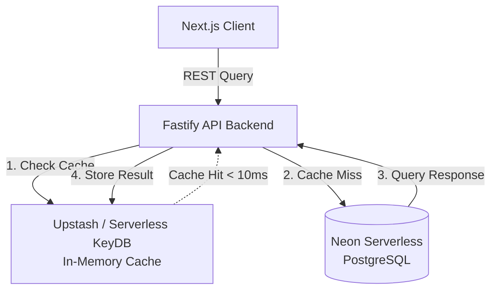

# Architectural Blueprint: Future KeyDB Caching Strategy

> [!IMPORTANT]
> **CURRENT IMPLEMENTATION STATUS: ON HOLD (FUTURE SCOPE)**
> Following user instructions, the caching layer is strictly preserved as a technical design blueprint for future scope and research. **No code changes or database migrations will be performed in the current cycle.** This document serves as a study to guide future integration.

---

## 1. Executive Summary & Objective

To scale FitSaaS to hundreds of concurrent users without degrading performance, we plan to place a high-throughput, low-latency **KeyDB** (an open-source, multi-threaded alternative to Redis) layer between our Next.js/Fastify servers and the Neon Serverless PostgreSQL database.

By caching high-frequency queries, we can:
1. **Reduce Database Latency**: Cut response times for critical endpoints from ~150ms down to under **10ms**.
2. **Optimize Query Expenses**: Eliminate redundant DB transactions (e.g., constantly checking user credentials or re-computing cycle statistics).
3. **Enhance Session Resiliency**: Offload auth JWT validation hits.

---

## 2. KeyDB Cache Placement Architecture



---

## 3. Targeted Caching Streams

### A. User Session Validation (Auth Cache)
- **Problem**: Every authenticated Fastify endpoint requests details about the token to run `@fastify/jwt` validation, requiring database reads to confirm user existence.
- **Proposed Solution**: Cache decrypted JWT details mapped to user IDs inside KeyDB.
- **TTL Configuration**: **15 Minutes** (sliding window).
- **Invalidation Strategy**: Evicted instantly upon `POST /auth/logout` or user deletion requests.

### B. Dashboard Metrics Caching
- **Problem**: When loading the dashboard, the application calculates active water progress, calorie balances, recent workout listings, and active menstrual cycle phase details on the fly.
- **Proposed Solution**: Store a serialized JSON representation of the dashboard payload inside KeyDB under the key `user:dashboard:<userId>`.
- **TTL Configuration**: **2 Hours**.
- **Invalidation Strategy (Write-Through)**:
  - If a user logs a new workout (`POST /workouts`), delete key `user:dashboard:<userId>`.
  - If a user logs water or daily weight (`PUT /auth/profile`), delete key `user:dashboard:<userId>`.
  - If a user records a cycle update (`POST /menstrual`), delete key `user:dashboard:<userId>`.

### C. Clinical Nutrition Blueprints
- **Problem**: Generating localized high-protein meal plans based on sub-diseases (PCOS, IBS, Thyroid) and dietary constraints takes considerable JSON filtering.
- **Proposed Solution**: Cache diet plans under `user:diet:<userId>:<type>:<intolerances>`.
- **TTL Configuration**: **7 Days** (highly static).
- **Invalidation Strategy**: Evict immediately when profile nutrition rules are updated.

---

## 4. TTL Rules & Eviction Pipeline Specifications

To prevent stale data states ("cache desynchronization"), we define explicit cache headers and evictions:

| Cache Category | Key Pattern | TTL (Time-To-Live) | Eviction Trigger |
| :--- | :--- | :--- | :--- |
| **User Session** | `session:<userId>` | 15 Minutes | Evicted instantly on password update or logout |
| **Dashboard Stats** | `dashboard:<userId>` | 2 Hours | Evicted on workout logs, profile saves, cycle saves |
| **Nutrition Logs** | `diet:<userId>` | 7 Days | Evicted on diet type changes or intolerances edits |
| **Activity Feed** | `activities:<userId>`| 24 Hours | Evicted when a workout is edited/deleted |

---

## 5. Rollout Roadmap & Cloud Provider Study

To implement caching in our next release cycle, we will evaluate the following rollout sequences:

### Phase 1: Prototype & Local Integration (1 Week)
- Run a multi-threaded KeyDB container locally via Docker:
  ```bash
  docker run -d -p 6379:6379 --name fitsaas-keydb eqalpha/keydb
  ```
- Write a lightweight Fastify connector (`packages/cache/keydb.ts`) with custom redis-compatible clients (`ioredis`).

### Phase 2: Serverless Deployment & Benchmark Testing (1 Week)
- Deploy KeyDB to **Upstash** (Serverless Redis/KeyDB hosting). Upstash offers direct compatibility, automatically scales, and charges based on request count:
  - **Free Tier**: 10,000 commands/day ($0 cost).
  - **Pay-as-you-go**: $0.20 per 100,000 commands.
- Run concurrent traffic benchmarks to verify that query loads remain light on Neon Serverless PG.

### Phase 3: Live Verification & Fallback Controls (1 Week)
- Configure strict fallback mechanisms: **If the KeyDB server encounters connection timeouts, immediately bypass the cache and query Neon PostgreSQL directly.** The user experiences a slightly slower load but zero application crashes!
