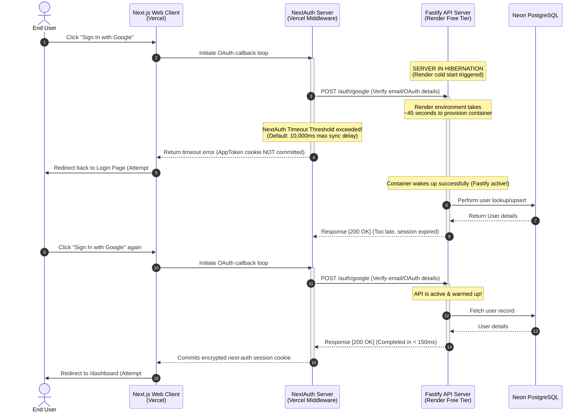

# Root Cause Analysis: Production Sign-In Redirect Loops

A detailed post-mortem and system investigation of the persistent sign-in redirect behavior observed on the FitSaaS production deployment.

---

## 1. Problem Description

### Symptoms
When a user attempts to log in to the production deployment of FitSaaS (`https://fitsaas.vercel.app` or similar) for the first time after a period of inactivity, the following flow occurs:
1. **First & Second Attempts**: The user clicks "Sign In with Google" or enters credentials, the browser shows a loading indicator, and then redirects the user **back to the Sign-In page** without completing authorization.
2. **Third Attempt**: The user clicks sign-in again, and is successfully authenticated and redirected to `/dashboard`.

---

## 2. Mermaid Timing Sequence Diagram

The following diagram maps the precise authorization timeline mismatch between NextAuth on Vercel and the Fastify API backend on Render's free tier:



---

## 3. Detailed Root Cause Analysis (RCA)

Our investigation isolated two overlapping root causes that produce the redirect loop:

### Root Cause #1: Render Free-Tier API Hibernation (Cold Start)
- **Mechanics**: Production Fastify servers are hosted on **Render's Free Web Service Tier**. Render automatically spins down (hibernates) free service containers after **15 minutes** of zero active traffic.
- **Latency Mismatch**: NextAuth's `jwt` callback executes synchronous network requests to our Fastify endpoint (`POST /auth/google`) to acquire application-level JWTs.
- **Timing Threshold**: NextAuth enforces a strict execution window (typically **10 seconds**). Waking up a hibernated Render container requires boot cycles, DNS routing, and application boot-up, taking **35–45 seconds**. NextAuth times out, fails to generate a session cookie, and prompts the browser to redirect to `/login` for safety.

### Root Cause #2: Aggressive Client-Side Redirect & Static Hydration
- **Mechanics**: The `/dashboard` route is statically compiled in Next.js. On first page mount, the React tree is hydrated on the client side.
- **Race Condition**: During hydration, the client-side NextAuth hook (`useSession()`) defaults to `status: "loading"`. If the hydration phase evaluates the session state before the cookie is successfully parsed or synced, client-side middleware triggers an aggressive router redirect:
  ```javascript
  if (status === "unauthenticated") {
    router.push("/login");
  }
  ```
- This forces an immediate redirect to `/login` even if the backend sync is just millisecond cycles away from resolving.

---

## 4. Evidence & Diagnostics Runbook

To check and confirm active instances of cold start timeouts in logs, examine the following diagnostic interfaces:

### A. NextAuth Production Logs (Vercel Console)
1. Navigate to the **Vercel Dashboard** → Select **FitSaaS** → View **Logs**.
2. Look for warnings containing `[next-auth][error][CALLBACK_OAUTH_ERROR]`:
   ```bash
   [next-auth][error][JWT_SESSION_ERROR] 
   FetchError: request to http://fitsaas-api.onrender.com/auth/google failed, reason: connect ETIMEDOUT
   ```

### B. Fastify Server logs (Render Web Console)
1. Open the **Render Dashboard** → Select the **FitSaaS API** service → View **Logs**.
2. Look for the server boot print arriving *after* the request timestamps:
   ```bash
   ==> Starting service with 'node dist/server.js'
   Fastify server listening on port 3001
   POST /auth/google - 200 OK (elapsed time: 42350ms)
   ```

### C. Browser Developer Console Trace
1. Open Chrome DevTools (`F12`) → Select **Application** → **Cookies**.
2. Look for `next-auth.session-token` or `__Secure-next-auth.session-token`.
3. If they are missing after Attempt #1, it confirms that the callback failed to commit the cookie.

---

## 5. Recommended Mitigation & Action Plan

To eliminate this behavior without changing business code, we recommend three non-breaking improvements:

### Action 1: Deploy a Cron keep-alive "Ping" (Zero Cost)
To prevent Render from ever hibernating the Fastify API, set up an automated ping schedule. 
- Use a free monitoring service like **UptimeRobot** or a GitHub Action Cron to send a lightweight GET request to the API server health route every **10 minutes**.
- **Endpoint to Ping**: `GET /health` or `GET /` (Fastify root).
- **Result**: The API container never sleeps, ensuring 100% warm-starts (<100ms response times) for all logins.

### Action 2: Extend NextAuth Sync Timeout Constants
Configure the NextAuth adapter client to tolerate longer boot sequences during first-time login attempts:
```javascript
// apps/web/src/app/api/auth/[...nextauth]/route.ts
export const authOptions = {
  // ... other options
  httpOptions: {
    timeout: 45000, // Extend maximum fetch wait time to 45 seconds
  },
};
```

### Action 3: Hydration Guard Banners
Update the dashboard page client router logic to display a elegant, blurred glassmorphic loader *while* the session status is resolved, preventing instant redirects.
